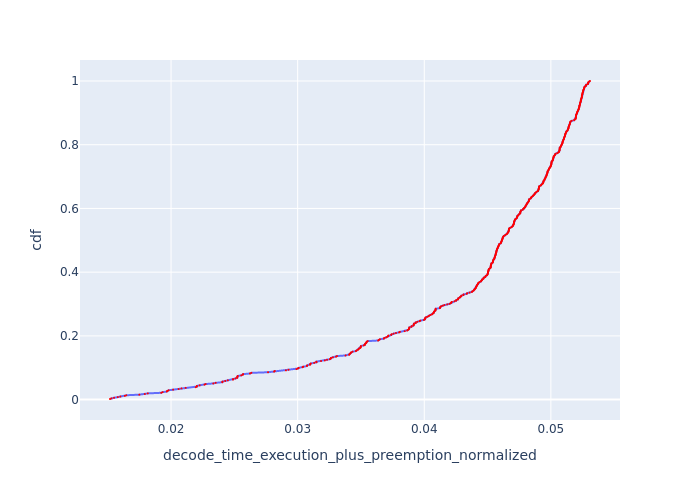
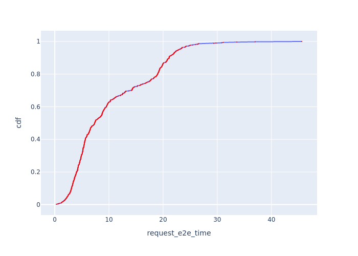

# Vidur: LLM Inference System Simulator (With AWS benchmark)

## Table of Contents
- [Supported Models](#supported-models)
- [Setup](#setup)
- [Reproduce AWS instructions](#reproduce-aws-instructions)
- [Analyze simulation](#analyze-simulation)
- [Running the simulator](#running-the-simulator)
- [Simulator Output](#simulator-output)
- [Contributing](#contributing)
- [Trademarks](#trademarks)

Vidur is a high-fidelity and extensible LLM inference system simulator. It can help you with:

1. Study the system performance of models under different workloads and configurations.

    | TTFT | TPOT | Request E2E Time | Batch Size |
    | --- | --- | --- | --- |
    |  |  |  |  |

    *`Llama-3-8B` running the [AzureLLMInferenceTrace2023_conv](https://github.com/Azure/AzurePublicDataset/blob/master/data/AzureLLMInferenceTrace_conv.csv) trace on single `A100 80GB` at 6.45 QPS*

1. Capacity planning and finding the best deployment configuration for your LLM deployments.
   
*Capacity per dollar for different deployment configurations vs TTFT-P90 and TBT-P99 for LLaMA2-70B.*
1. Quickly test new research ideas like new scheduling algorithms, optimizations like speculative decoding, etc.

... all without access to GPUs except for a quick initial profiling phase 🎉. We highly recommend checking out our [MLSys'24 paper](https://arxiv.org/abs/2405.05465) and [talk](https://mlsys.org/virtual/2024/poster/2667) for more details.


## Supported Models

__Instructions on adding a new model to existing or new SKUs can be found [here](docs/profiling.md)__.
### Supporting models in AWS instances (need to add profiles from s3://binghann/vidur_qps/profiling)

| Model / Device | A10G_g5.48xlarge | L4_g6.48xlarge | A100_p4d.24xlarge | H100_p5.48xlarge | L40S_g6e.48xlarge |
| --- | --- | --- | --- | --- | --- |
| `meta-llama/Meta-Llama-3-8B` | ✅ | ✅ | ✅ | ✅ | ✅ |
| `Qwen/Qwen2.5-1.5B` | ✅ | ✅ | ✅ | ✅ | ✅ |

### Supporting models from original repo
| Model / Device | A100 80GB DGX | H100 DGX | 4xA100 80GB Pairwise NVLink Node | 8xA40 Pairwise NVLink Node |
| --- | --- | --- | --- | --- |
| `meta-llama/Meta-Llama-3-8B` | ✅ | ❌ | ✅ | ❌ |
| `meta-llama/Meta-Llama-3-70B` | ✅ | ❌ | ✅ | ❌ |
| `meta-llama/Llama-2-7b-hf` | ✅ | ✅ | ✅ | ✅ |
| `codellama/CodeLlama-34b-Instruct-hf"` | ✅ | ✅ | ✅ | ✅ |
| `meta-llama/Llama-2-70b-hf` | ✅ | ✅ | ✅ | ✅ |
| `internlm/internlm-20b` | ✅ | ✅ | ✅ | ✅ |
| `Qwen/Qwen-72B` | ✅ | ✅ | ✅ | ✅ |


* All models support a maximum context length of 4k except `Llama3-8B` and `Llama3-70B` which support 16k context length by passing additional CLI params:

    ```text
    --random_forrest_execution_time_predictor_config_prediction_max_prefill_chunk_size 16384 \
    --random_forrest_execution_time_predictor_config_prediction_max_batch_size 512 \
    --random_forrest_execution_time_predictor_config_prediction_max_tokens_per_request 16384
    ```

* Pipeline parallelism is supported for all models. The PP dimension should divide the number of layers in the model.
* In DGX nodes, there are 8 GPUs, fully connected via NVLink. So TP1, TP2, TP4 and TP8 are supported.
* In 4x pairwise NVLink nodes, there are 4 GPUs, so TP1, TP2 and TP4 are supported. TP4 here is less performant than TP4 in DGX nodes because (GPU1, GPU2) are connected via NVLink and (GPU3, GPU4) are connected via NVLink. but between these layers, the interconnect is slower.
* You can use any combination of TP and PP. For example, you can run LLaMA2-70B on TP2-PP2 on a 4xA100 80GB Pairwise NVLink Node.


## Setup

For details on facilitating new model profiling, please refer to [Adding a new model](docs/profiling.md#adding-a-new-model) section in the profiling documentation.
### Install all dependencies (Recommended)
Profiling feature for vidur is facilited with [`sarathi-serve`](https://github.com/nba556677go/sarathi-serve). A simpler way to setup environment is to install all dependencies in one conda environment
1. Clone the [`sarathi-serve`](https://github.com/nba556677go/sarathi-serve) GitHub repo.
2. Checkout branch [`vidur`](https://github.com/nba556677go/sarathi-serve/tree/vidur)
3. make sure current vidur repo exists in the same file directory as sarathi-serve. 
4. Follow `sarathi-serve` README to install it.
5. After instsallation, activate `sarathi-vidur` environment
```sh
mamba activate sarathi-vidur
```

### Install vidur dependencies without profiling 
If you dont want to test out profiling feature, you dont need to download [`sarathi-serve`](https://github.com/nba556677go/sarathi-serve) repo. Follow the command below to install environment.
#### Using `mamba`

To run the simulator, create a mamba environment with the given dependency file.

```sh
mamba env create -p ./env -f ./environment.yml
mamba env update -f environment-dev.yml
```

#### Using `venv`

1. Ensure that you have Python 3.10 installed on your system. Refer <https://www.bitecode.dev/p/installing-python-the-bare-minimum>
2. `cd` into the repository root
3. Create a virtual environment using `venv` module using `python3.10 -m venv .venv`
4. Activate the virtual environment using `source .venv/bin/activate`
5. Install the dependencies using `python -m pip install -r requirements.txt`
6. Run `deactivate` to deactivate the virtual environment

#### Using `conda` (Least recommended)

To run the simulator, create a conda environment with the given dependency file.

```sh
conda env create -p ./env -f ./environment.yml
conda env update -f environment-dev.yml
```

### Setting up wandb (Optional)

First, setup your account on `https://<your-org>.wandb.io/` or public wandb, obtain the api key and then run the following command,

```sh
wandb login --host https://<your-org>.wandb.io
```

To opt out of wandb, pick any one of the following methods:

1. `export WANDB_MODE=disabled` in your shell or add this in `~/.zshrc` or `~/.bashrc`. Remember to reload using `source ~/.zshrc`.
2. Set `wandb_project` and `wandb_group` as `""` in `vidur/config/default.yml`. Also, remove these CLI params from the shell command with which the simulator is invoked.


## Reproduce AWS instructions
- in [here](docs/reproduce.md)


## Analyze simulation
- in [here](docs/analysis.md)


## Running the simulator 


To run the simulator, execute the following command from the repository root,

```sh
python -m vidur.main
```

or a big example with all the parameters,

```sh
python -m vidur.main  \
--replica_config_device a100 \
--replica_config_model_name meta-llama/Meta-Llama-3-8B \
--cluster_config_num_replicas 1 \
--replica_config_tensor_parallel_size 1 \
--replica_config_num_pipeline_stages 1 \
--request_generator_config_type synthetic \
--synthetic_request_generator_config_num_requests 512  \
--length_generator_config_type trace \
--trace_request_length_generator_config_max_tokens 16384 \
--trace_request_length_generator_config_trace_file ./data/processed_traces/splitwise_conv.csv \
--interval_generator_config_type poisson \
--poisson_request_interval_generator_config_qps 6.45 \
--replica_scheduler_config_type sarathi  \
--sarathi_scheduler_config_batch_size_cap 512  \
--sarathi_scheduler_config_chunk_size 512 \
--random_forrest_execution_time_predictor_config_prediction_max_prefill_chunk_size 16384 \
--random_forrest_execution_time_predictor_config_prediction_max_batch_size 512 \
--random_forrest_execution_time_predictor_config_prediction_max_tokens_per_request 16384
```

or to get information on all parameters,

```sh
python -m vidur.main -h
```

## Simulator Output

* The metrics will be logged to wandb directly and a copy will be stored in the `simulator_output/<TIMESTAMP>` directory. __A description of all the logged metrics can be found [here](docs/metrics.md).__
* Vidur exports chrome traces of each simulation. The trace can be found in the `simulator_output` directory. The trace can be opened by navigating to `chrome://tracing/` or `edge://tracing/` and loading the trace.

    


## Analysis on benchmark and simulation results are documented [here](docs/analysis.md)__.

## Using Canary Build

We have been working on several improvements for the simulator, including support for prefix caching, different routing policies, reducing memory requirements for the simulator, etc. However, there are some sharp edges that we are working on resolving. In the meantime, if you are looking for support for any of these features, please use the `canary` branch.

## Contributing

This project welcomes contributions and suggestions.  Most contributions require you to agree to a
Contributor License Agreement (CLA) declaring that you have the right to, and actually do, grant us
the rights to use your contribution. For details, visit https://cla.opensource.microsoft.com.

When you submit a pull request, a CLA bot will automatically determine whether you need to provide
a CLA and decorate the PR appropriately (e.g., status check, comment). Simply follow the instructions
provided by the bot. You will only need to do this once across all repos using our CLA.

This project has adopted the [Microsoft Open Source Code of Conduct](https://opensource.microsoft.com/codeofconduct/).
For more information see the [Code of Conduct FAQ](https://opensource.microsoft.com/codeofconduct/faq/) or
contact [opencode@microsoft.com](mailto:opencode@microsoft.com) with any additional questions or comments.

## Trademarks

This project may contain trademarks or logos for projects, products, or services. Authorized use of Microsoft 
trademarks or logos is subject to and must follow 
[Microsoft's Trademark & Brand Guidelines](https://www.microsoft.com/en-us/legal/intellectualproperty/trademarks/usage/general).
Use of Microsoft trademarks or logos in modified versions of this project must not cause confusion or imply Microsoft sponsorship.
Any use of third-party trademarks or logos are subject to those third-party's policies.

